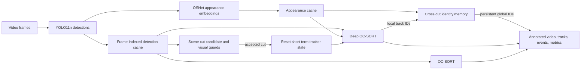

# Scene Cut Aware Multi-Object Tracking

This project compares object detection and multi-object tracking on full video clips. Its main idea is simple: a tracker follows detections from frame to frame, but a hard edit can make the next frame belong to a different camera or shot. The cut-aware method detects that transition, clears motion state that no longer makes sense, and uses appearance features to try to reconnect identities across the edit.

The repository also includes a separate car-tracking collection for highway and rainy-road footage. All detector weights are local, and the experiments use pretrained models without training or fine-tuning.

## At a glance



Detection and appearance features are computed once per source clip and shared by the applicable tracker methods. This makes the tracker comparisons easier to interpret: methods for a clip receive the same cached detections rather than making separate detector calls.

## The processing pipeline

### 1. Decode every frame

The source is read in frame order. Each frame keeps its zero-based frame index. The output video retains the source frame count, frame rate, and resolution; processing does not intentionally sample or skip frames.

### 2. Detect the configured object class with YOLO11n

The local `yolo11n.pt` model produces bounding boxes, confidence scores, and COCO class IDs. The detector filters to one configured class before tracking:

| Experiment family | Target | COCO class ID |
| --- | --- | ---: |
| People tracking | person | 0 |
| Vehicle collection | car | 2 |

The car experiment selects **cars**. It does not include buses, trucks, or motorcycles. Confidence, image size, and maximum detections are configuration values; they can be adjusted per clip when lighting, blur, or object scale makes one shared setting unsuitable.

### 3. Cache detections by frame

Each detection row is stored with its source frame index. All tracker methods for that source read the same detection cache. The cache records source metadata and detector settings so stale detections can be recognized when a clip or configuration changes.

### 4. Compute and cache OSNet appearance features

For methods that use appearance, OSNet converts each detected crop into a feature vector, also called an embedding. The embedding cache uses frame offsets so the vectors for a frame can be retrieved alongside that frame’s detections. Deep OC-SORT and the cut-aware identity layer reuse these vectors instead of recomputing them for each method.

The available `osnet_x0_25_msmt17.pt` weights were trained for **person re-identification**. They are appropriate to the people-tracking experiments, but they are not a car-ReID model. Car appearance matches from these weights are exploratory and must not be presented as verified vehicle identities.

## The tracker comparisons

The project has three independently configured experiment families. A family’s config defines its videos, methods, per-video detector and tracker settings, and output locations.

### OC-SORT baseline

OC-SORT associates detections over time using motion prediction and bounding-box overlap. A Kalman filter predicts where a track should appear; new detections are matched against active tracks. Its IDs describe the tracker’s current tracks. The baseline has no cross-cut appearance recovery.

### Deep OC-SORT

Deep OC-SORT uses the same YOLO detections and combines motion and geometric association with OSNet appearance features. Appearance can help associate detections when motion and overlap alone are ambiguous. It remains a tracker operating on frame-to-frame detections; its person-trained appearance model should not be assumed to identify cars reliably.

### Deep OC-SORT with scene-cut recovery

This method uses Deep OC-SORT within a shot and adds two pieces around it:

1. A hard-cut detector decides whether the current frame starts a new shot.
2. A long-term identity memory tries to map new tracker IDs back to identities from before the cut.

The method still uses Deep OC-SORT. It is not a separate DeepSORT tracker.

### Appearance-weight ablation

The four-method comparison also includes `deep_ocsort_osnet`, which increases the OSNet appearance association weight and disables adaptive weighting. It tests a stronger fixed appearance contribution within Deep OC-SORT. The selected-clips and car galleries use the three methods above and do not include this ablation.

## How scene-cut detection works

The cut-aware method processes each frame with PySceneDetect’s `ContentDetector`. For adjacent frames, the detector measures mean pixel change in hue, saturation, and brightness (luma) channels. With the configured default weights, its content score is:

```text
score = (delta_hue + delta_saturation + delta_luma) / 3
```

The edge-change component has weight zero in this configuration. A content score at or above **27** makes the frame a *candidate* cut; it is not a probability and does not by itself reset the tracker.

The project then checks a candidate against two more measurements. Frames are resized to 320 × 180 for these checks:

| Guard | What it measures | Current selected threshold |
| --- | --- | ---: |
| Pixel difference | Average absolute channel difference between adjacent resized frames, divided by 255 | at least 0.12 |
| HSV histogram distance | Bhattacharyya distance between normalized 16 × 16 × 16 HSV histograms | at least 0.40 |

Both guards must pass. A candidate must also be at least **15 frames after the last accepted cut**. The spacing rule is applied after the extra checks, so a rejected candidate does not start the spacing timer. PySceneDetect’s flash suppression is enabled to reduce brief flashes being treated as edits.

The cut decision can therefore be summarized as:

```text
ContentDetector score >= 27
AND pixel difference >= 0.12
AND HSV histogram distance >= 0.40
AND 15-frame spacing condition passes
    => accepted hard cut
```

These are hand-set engineering thresholds, not values learned from labeled cuts. They reduce some false alarms but cannot guarantee that every edit is found or every accepted event is a true edit. The selected `resist` clip has a per-video pixel guard of 0.07; the other selected clips use the default shown above. Values for the car collection are recorded in its own config.

## What happens when a cut is accepted

At an accepted cut, Deep OC-SORT discards its short-term tracks and camera-motion state. This prevents positions and motion estimates from the old shot from being carried into a visually different shot. The long-term identity gallery is kept.

This reset creates new **local IDs** in the new shot. The identity layer maps them to **global IDs** that can persist across accepted cuts:

```text
Deep OC-SORT local ID + OSNet embedding
                   ↓
        IdentityMemory.assign(...)
                   ↓
match an old appearance → reuse its global ID
no eligible match       → allocate a new global ID
```

Immediately after a cut, the layer opens a 15-frame recovery window. It keeps up to 20 normalized embeddings per global identity and averages them into an appearance prototype. New local tracks are compared with old prototypes using cosine similarity. A Hungarian one-to-one assignment prevents two new tracks from claiming the same old identity in that recovery window. A match is accepted only at similarity **0.75 or higher**; otherwise the track receives a new global ID. Once a local ID is mapped, that mapping remains in effect for the rest of the shot.

An accepted similarity is an algorithm decision, not proof that the identity is correct. Similar uniforms, lighting changes, blur, occlusion, and viewpoint changes can all produce mistaken or missed matches.

## Scene cuts and occlusion are different events

The cut-aware identity recovery is triggered by a hard edit. It is not a general solution for a person or car being hidden and then reappearing in the **same continuous shot**. Within a shot, OC-SORT or Deep OC-SORT may keep a track through a short detection gap using their tracking logic, but the cross-cut identity gallery is not invoked just because an object was occluded.

## Experiment collections

| Collection | Config | Purpose | Methods |
| --- | --- | --- | --- |
| Canonical comparison | `configs/ultimate_cpu.yaml` | Five person clips and a four-method comparison, including the appearance-weight ablation | OC-SORT, Deep OC-SORT, appearance-weight ablation, cut-aware Deep OC-SORT |
| Selected clips | `configs/selected_clips_cpu.yaml` | Nine selected person clips: `oppie`, `resist`, `Joker`, `elonkanye`, `saul`, `MI6`, and `football-1/2/3` | OC-SORT, Deep OC-SORT, cut-aware Deep OC-SORT |
| Car clips | `configs/busrec_cpu.yaml` | `busrec.mp4`, `CarHighWay.mp4`, and `BusRain.mp4`, filtered to COCO cars | OC-SORT, Deep OC-SORT, cut-aware Deep OC-SORT |

Per-video overrides are intentional. For example, the night highway and rainy-road clips use lower car confidence thresholds than the brighter busrec clip. The effective values for each run are saved with its outputs.

## Which results to view

### To see scene-cut handling

Open `outputs/reports/selected_clips_gallery.html`, find **MI6**, and compare these two cards:

- **YOLO11 + Deep OC-SORT** — tracking without cut resets or cross-cut identity recovery.
- **YOLO11 + Deep OC-SORT + Scene Cut + OSNet ReID** — the cut-aware method.

In the currently saved MI6 result, the cut-aware run reports accepted cuts at frames **198, 367, 443, 537, 613, 681, 763, and 851**, plus 17 accepted appearance matches. Those matches are unverified, so inspect the annotated video and event log instead of treating the count as an accuracy score. `resist` is another useful cut example; its saved cut-aware run reports 11 accepted cuts.

### To see car detections and IDs

Open `outputs/reports/busrec_gallery.html`. Compare the three method cards for **BusRain**, **CarHighWay**, or **busrec**. Look at whether boxes stay attached to vehicles, how IDs persist as vehicles move through the frame, and where a method starts or changes an ID. The saved BusRain and CarHighWay results have no accepted cuts, so they demonstrate car tracking—not cross-cut recovery.

### To inspect an output beyond the video

Each completed method directory contains the annotated video and supporting records. `tracks.csv` includes frame, local ID, global ID, box coordinates, confidence, class, and tracker generation. `events.jsonl` records accepted cuts and identity decisions. `metrics.json` summarizes frame coverage, IDs, cuts, and recovery counts. These diagnostics describe what the code did; they do not measure identity accuracy without ground-truth annotations.

## Outputs and provenance

The experiment runner saves its results under the configured output root. A typical completed method directory contains:

| Artifact | Contents |
| --- | --- |
| `annotated.mp4` / `annotated_h264.mp4` | Full-frame visual result; H.264 copy is browser-friendly |
| `tracks.csv` | Human-readable per-frame track records, including local and global IDs |
| `tracks_mot.txt` | MOTChallenge-style track rows |
| `events.jsonl` | Scene-cut and identity assignment events; empty when none occurred |
| `metrics.json` | Frame counts, runtime, track counts, cuts, and recovery decisions |
| `effective_config.yaml` | Merged base and per-video settings used by the run |
| `run_metadata.json` | Source, runtime, detector cache, appearance cache, and model provenance |
| `plots/` and `sample_frames/` | Track-count and duration diagnostics plus selected annotated frames |

Detection and appearance caches are separate from tracker outputs. A cache is checked against its source video and relevant configuration so incompatible cached rows are not silently reused. Galleries link to the browser-friendly annotated videos and show pending cards when a configured output is not present.

## Reading results honestly

The custom clips do not have ground-truth person or vehicle identities. Frame coverage, detector boxes, track counts, IDs, cut events, similarity values, and runtime can be inspected, but they do not establish tracking accuracy. HOTA, IDF1, MOTA, true identity switches, and verified ReID recovery require suitable identity annotations. No metric in a gallery should be interpreted as proof that two boxes belong to the same real-world object.

## Project map

| Path | Responsibility |
| --- | --- |
| `configs/` | Experiment videos, methods, thresholds, and output locations |
| `src/scenecut_tracking/detector.py` | YOLO detector loading and class filtering |
| `src/scenecut_tracking/detection_cache.py` | Frame-indexed detections and source validation |
| `src/scenecut_tracking/appearance_cache.py` and `reid.py` | OSNet embeddings and their frame-indexed cache |
| `src/scenecut_tracking/ocsort_tracker.py` | OC-SORT adapter |
| `src/scenecut_tracking/deep_ocsort_tracker.py` | Deep OC-SORT adapter and motion reset |
| `src/scenecut_tracking/scene_cut.py` | PySceneDetect candidates and hard-cut visual guards |
| `src/scenecut_tracking/identity_memory.py` | Global identity gallery and cross-cut matching |
| `src/scenecut_tracking/runner.py` and `deep_runner.py` | Frame-by-frame experiment orchestration and output writing |
| `src/scenecut_tracking/video_gallery.py` | Browser gallery generation |
